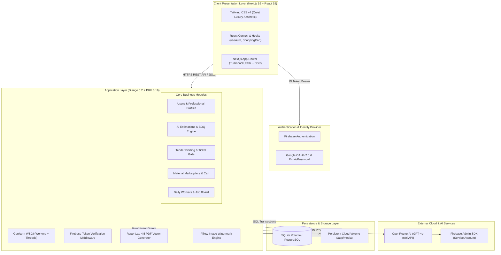

# BuildMe.lk — Complete System Architecture & Technical Specification

> **Platform Version:** 2.0.0 (Production)  
> **Target Region:** Sri Lanka  
> **System Classification:** Multi-Sided Quiet-Luxury Construction Marketplace & AI Estimation Ecosystem

---

## 1. Executive Summary & Vision

**BuildMe.lk** is a centralized digital construction marketplace engineered specifically for the Sri Lankan residential and commercial building sector. 

In Sri Lanka, individual homebuilders face severe challenges: opaque material pricing, unverified contractor claims, lack of standard engineering contracts, unpredictable labor availability, and absence of standardized budget planning. BuildMe.lk bridges this trust and information deficit through a unified, full-stack digital platform:

1. **AI-Driven House Construction Cost Estimator:** Generates accurate multi-parameter bill of quantities (BOQ) with dynamic Sri Lankan market pricing, architectural briefs, and downloadable branded PDF reports.
2. **Open Project Bidding & Tender Marketplace:** Homeowners publish approved project estimations to receive competitive proposals from verified contractors, engineers, and architects.
3. **Monetized Ticket Paywall System:** Protects professional contact privacy and eliminates tender spam via a structured credit bundle model.
4. **Live Construction Material Marketplace:** E-commerce catalog tracking real-time market prices with an automated AI price crawler, inventory tracking, and shopping cart.
5. **Verified Professional Directory:** Portfolios, certifications, experience records, and verified reviews for contractors, architects, quantity surveyors, lawyers, and tradespeople.
6. **On-Demand Daily Worker Job Board:** Rapid job posting and application platform for site helpers, masons, electricians, and plumbers.
7. **Hardware Store Network:** Directory of local hardware stores, inventory listings, opening hours, and location mapping.

---

## 2. High-Level System Architecture

The platform follows a decoupled, headless client-server architecture deployed on cloud infrastructure:



---

## 3. Technology Stack Breakdown

### 3.1 Frontend Tier

| Technology | Version | Purpose & Rationale |
| :--- | :--- | :--- |
| **Next.js** | `16.2.6` | React framework using the App Router with Turbopack for lightning-fast compilation, server/client component splitting, and production route pre-rendering. |
| **React** | `19.2.4` | Modern declarative UI library providing asynchronous state management, concurrent transitions, and hook-based lifecycle isolation. |
| **Tailwind CSS** | `^4.0.0` | Utility-first CSS engine driven by `@tailwindcss/postcss`. Custom-styled with a "Quiet Luxury" architectural palette (`#8B4434` terracotta, `#281713` rich timber, `#FCFAF7` limestone marble). |
| **TypeScript** | `^5.0.0` | Strict static typing across all entities, API request/response contracts, and UI state handlers. |
| **Firebase Client SDK** | `^12.13.0` | Client-side identity provider handling Google OAuth popups, email/password signup, password resets, and automated JWT token rotation. |
| **Lucide React** | `^1.17.0` | Lightweight, scalable vector iconography matching architectural aesthetics. |

### 3.2 Backend Tier

| Technology | Version | Purpose & Rationale |
| :--- | :--- | :--- |
| **Python** | `3.12-slim` | Optimized, modern runtime with performance gains in memory management and async operations. |
| **Django** | `5.2.4` | Battle-tested, high-productivity Python web framework providing ORM, security middlewares, migrations, and administrative interfaces. |
| **Django REST Framework** | `3.16.0` | Robust REST API layer with model serializers, ViewSets, custom permissions, and standardized pagination. |
| **Firebase Admin SDK** | `7.4.0` | Server-side verification of incoming Firebase ID tokens, mapping UIDs to internal `CustomUser` database records without exposing secrets. |
| **ReportLab** | `4.5.1` | Programmatic PDF generation creating professional multi-page estimation reports with dynamic page-numbering, tables, and watermarks. |
| **Pillow (PIL)** | `Latest` | Programmatic image manipulation applying 45-degree semi-transparent security watermarks onto professional portfolio and certification uploads. |
| **Gunicorn** | `21.2.0` | Production WSGI HTTP server with multi-worker pre-fork architecture and thread pools. |
| **WhiteNoise** | `6.8.2` | High-efficiency static file serving directly from Gunicorn with gzip/brotli compression and persistent cache headers. |
| **dj-database-url / psycopg2** | `2.1.0` | Automated database configuration from environment strings, enabling frictionless switching between SQLite and PostgreSQL. |

---

## 4. Key Subsystems & How They Work

### 4.1 Hybrid Authentication & Identity Synchronization

BuildMe.lk utilizes a **Zero-Password Backend** pattern:
1. **Client Authentication:** The client signs in via Firebase (Google Sign-In or Email/Password). Firebase handles password encryption, multi-factor, and email verification.
2. **Token Transmission:** The frontend retrieves a fresh Firebase JWT ID token (`getIdToken()`) and passes it in the `Authorization: Bearer <token>` header to the Django backend.
3. **Server Verification:** Django's custom `FirebaseAuthentication` backend intercepts the request:
   - Uses `firebase_admin.auth.verify_id_token(token)` to validate signature and expiration.
   - Extracts `uid`, `email`, and `name`.
   - Locates or automatically provisions the internal `CustomUser` record with the corresponding `firebase_uid`.
   - Attaches `request.user` to the DRF request pipeline.
4. **Role Selection (Onboarding):** Upon initial sign-up, the user selects between `CLIENT` (Homeowner) and `PROFESSIONAL` (Contractor, Architect, QS, Hardware Owner, etc.). Specialized profile models are auto-instantiated.

---

### 4.2 AI Construction Cost Estimation & PDF Generation Engine

The estimation module (`backend/estimations`) calculates construction budgets for Sri Lankan properties:

1. **Parameter Ingestion:**
   - House size, land size, total area in sqft
   - Number of floors, rooms, bathrooms, kitchens, balconies, garages
   - Material preferences (cement brand, river sand vs. manufactured sand, roof tiles vs. sheets, metal types)
   - Quality tier (`STANDARD` vs. `LUXURY`)
2. **Cost Algorithmic Breakdown:**
   - Calculates material quantities and labor wages based on standard civil engineering formulas tailored to Sri Lankan market conditions.
   - Separate calculations for foundation, brickwork, roofing, electrical wiring, plumbing, and interior finishes.
3. **OpenRouter AI Design Strategy:**
   - Ingests project specifications and queries `openai/gpt-4o-mini` via OpenRouter.
   - Generates architectural direction, layout recommendations, cross-ventilation advice, and budget optimization tips in structured JSON.
   - **Fault-Tolerant Fallback:** If the external AI API is unreachable or unconfigured, an intelligent heuristic rule-based engine generates a tailored design brief so the client is never blocked.
4. **ReportLab PDF Generator:**
   - Generates a downloadable, branded PDF (`_build_pdf`) featuring:
     - Document header with date, estimation ID, and client specifications
     - Color-coded summary callout cards (Material Cost, Labor Cost, Total Budget)
     - AI Design Direction & Layout Strategy
     - Itemized Bill of Quantities table
     - Transparent full-page background watermark preventing unauthorized tampering

---

### 4.3 Open Bidding Tender Marketplace & Monetization Gate

1. **Tender Publishing:** Clients can convert their AI estimation into an open project post (`ProjectPost`) with a single click.
2. **Contractor Bidding:** Registered contractors, architects, and engineers view open tender requirements (sqft, floors, specifications, budget range) and submit bids with price, timeframe, and cover letters.
3. **Ticket Paywall System (`TicketBundle` & `ProjectUnlock`):**
   - Professional contact details (phone number, email, real identity) are private by default.
   - Homeowners purchase a **Ticket Bundle** (e.g., 3 unlocks for LKR 500) or use introductory credits.
   - Unlocking a project grants persistent access to that project's direct contact and proposal information.
   - Eliminates spam and monetizes platform matchmaking.
4. **Bid Acceptance:** When a client accepts a bid, the winning proposal status changes to `ACCEPTED`, other bids transition to `REJECTED`, and the project status advances to `IN_PROGRESS`.

---

### 4.4 Live Material Marketplace & AI Price Crawler

1. **Automated AI Price Crawler (`backend/marketplace/services.py`):**
   - Monitors market indices for essential construction commodities in Sri Lanka (Tokyo Super cement, Sanstha cement, river sand, 12mm TMT steel bars, clay bricks).
   - Updates `ai_price` and sets `last_ai_update = timezone.now()`.
   - Stale detection checks whether the cached price is older than 24 hours.
   - Admin override option (`use_manual_price` / `manual_price`) allows manual price fixing during market volatility.
2. **Public E-Commerce Catalog:**
   - Shows live AI market prices, price-per-unit (`Rs. 4500.00 / cube`), and human-friendly relative update indicators (`AI updated 2h ago`).
   - Integrated shopping cart with local session persistence and checkout triggers.

---

### 4.5 On-Demand Daily Workers & Hardware Stores

- **Daily Jobs (`DailyJob` & `JobApplication`):** Site managers and homeowners post urgent daily requirements (e.g., 3 Masons in Kandy for tomorrow). Workers apply directly from their smartphones.
- **Hardware Shops (`HardwareShop` & `HardwareShopItem`):** Physical hardware store owners showcase their store location, business registration, opening hours, gallery images, and available inventory.

---

## 5. Security & Data Protection Architecture

```
                                [ CLIENT HTTPS REQUEST ]
                                           │
                                           ▼
                            [ Gunicorn / Reverse Proxy ]
                                           │
                           [ CORS Headers Middleware ]
                      (Strict Allowed Origins & Credentials)
                                           │
                                           ▼
                         [ WhiteNoise Static Serving ]
                                           │
                                           ▼
                      [ FirebaseAuthentication Middleware ]
                 (Decode JWT, Verify Signature, Expiry, UID)
                                           │
                                           ▼
                         [ Role-Based Access Control ]
              ┌────────────────────────────┼────────────────────────────┐
              ▼                            ▼                            ▼
      [ Client Actions ]        [ Professional Actions ]       [ Admin Actions ]
     (Create Tenders, Cart,      (Submit Bids, Create Jobs,    (Django Admin,
      Buy Tickets, Reviews)       Upload Certifications)        Price Overrides)
```

1. **Zero Password Storage:** Passwords never touch the backend application or database. Firebase handles credential hashing (scrypt) and token issuance.
2. **CORS & CSRF Protection:** Explicit `CORS_ALLOWED_ORIGINS` for client domains, strict trusted CSRF origins, and secure reverse proxy SSL header forwarding (`HTTP_X_FORWARDED_PROTO: https`).
3. **Database Security:** Parameterized queries via Django ORM completely prevent SQL injection vulnerabilities.
4. **Secure Media & Digital Watermarking:** Uploaded portfolio and certification images pass through Pillow in memory to receive copyright watermarks before persisting to disk.
5. **Role-Based Permissions:** Restricts professional operations (submitting bids, worker posts) and client operations (accepting proposals, purchasing ticket bundles) via DRF `IsAuthenticated` and custom permissions.

---

## 6. Cloud Deployment & DevOps Pipeline

BuildMe.lk is designed for high-availability cloud deployment on **Railway**:

### 6.1 Backend Containerization (`Dockerfile`)
- **Base Image:** `python:3.12-slim`
- **System Packages:** `build-essential`, `libpq-dev`
- **Execution Workflow:**
  1. Copies dependencies and installs via `pip --no-cache-dir`.
  2. Runs `collectstatic --noinput` to prepare WhiteNoise static bundles.
  3. Startup command triggers automated migrations (`migrate --noinput`), initial data seeding (`load_initial_data.py`), and spawns Gunicorn with 2 workers, 4 threads, and 120s timeout on dynamic `$PORT`.
  4. Persistent media volume mounted at `/app/media` ensures user uploads and SQLite data persist across redeployments.

### 6.2 Frontend Containerization (`nixpacks.toml` & `railway.json`)
- **Build Engine:** Railway Nixpacks pinned to **Node.js 20** (`nodejs_20`, `npm-10_x`).
- **Engines Field:** Explicitly configured with `"engines": { "node": ">=20.9.0" }` to support Next.js 16 requirements.
- **Production Execution:** `npm run start -- -p $PORT -H 0.0.0.0`.
- **Dynamic API Fallback:** When running in production without explicit local env vars, frontend API calls automatically route to the production backend (`https://buidmelkv2-production.up.railway.app/api`).

---

## 7. Environment Variables Matrix

### Backend (`backend/.env`)

| Variable Name | Required | Description |
| :--- | :--- | :--- |
| `SECRET_KEY` | Yes | Django cryptographic signing key. |
| `DEBUG` | No | Debug mode toggle (`False` in production). |
| `ALLOWED_HOSTS` | Yes | Comma-separated hostnames or `*`. |
| `DATABASE_URL` | No | PostgreSQL connection URI (falls back to persistent SQLite). |
| `FIREBASE_CREDENTIALS_JSON` | Yes | Minified service account JSON string for production. |
| `OPENROUTER_API_KEY` | No | API key for AI design briefs and dynamic price crawlers. |
| `OPENROUTER_MODEL` | No | Default LLM model (`openai/gpt-4o-mini`). |

### Frontend (`frontend/.env.local`)

| Variable Name | Required | Description |
| :--- | :--- | :--- |
| `NEXT_PUBLIC_BACKEND_URL` | Yes | Base URL to Django API (e.g., `https://.../api`). |
| `NEXT_PUBLIC_FIREBASE_API_KEY` | Yes | Firebase project Web API Key. |
| `NEXT_PUBLIC_FIREBASE_AUTH_DOMAIN`| Yes | Firebase project authentication domain. |
| `NEXT_PUBLIC_FIREBASE_PROJECT_ID` | Yes | Firebase project identifier. |
| `NEXT_PUBLIC_FIREBASE_STORAGE_BUCKET` | Yes | Cloud storage bucket name. |
| `NEXT_PUBLIC_FIREBASE_MESSAGING_SENDER_ID` | Yes | Firebase Cloud Messaging sender ID. |
| `NEXT_PUBLIC_FIREBASE_APP_ID` | Yes | Firebase application client ID. |
